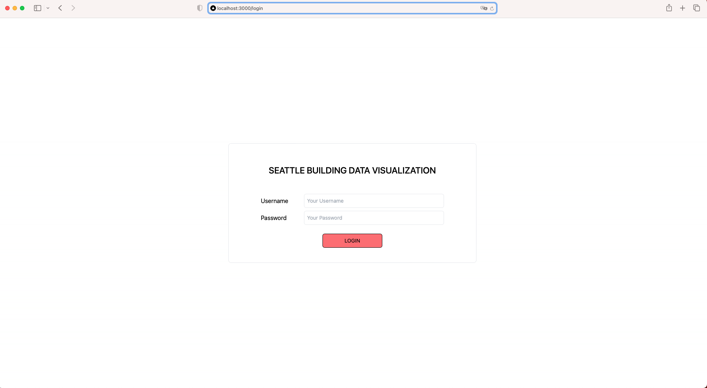
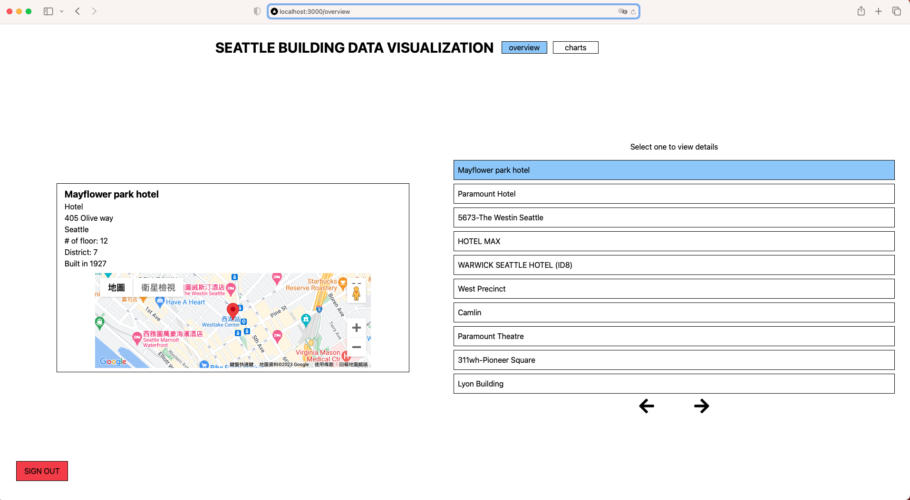
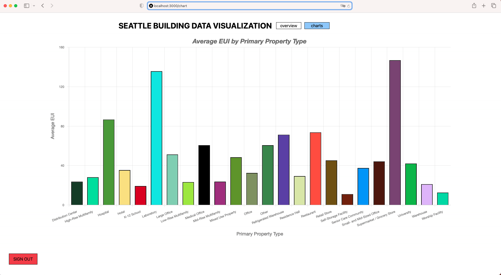

# Seattle Building Data Visualization app

## Getting Started

```sh
# docker

# use docker-compose
docker-compose up
```

Open [http://localhost:3000](http://localhost:3000) with your browser to see the result.

## Login Page



## Overview Page



## Chart Page


